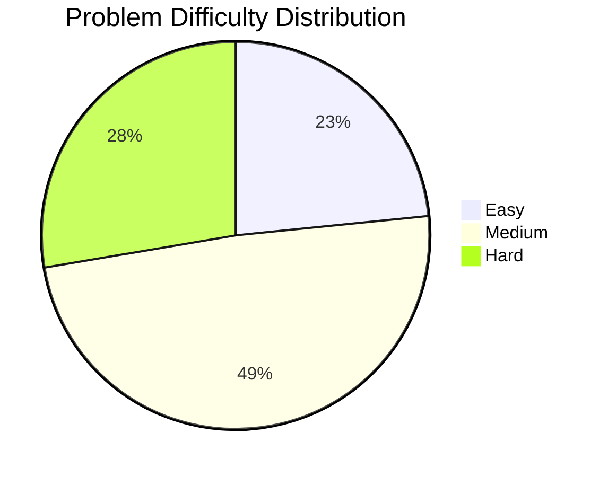
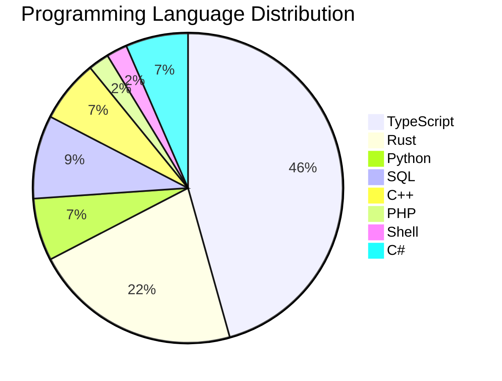

# Journal des Solutions LeetCode

| Date | Problème | Difficulté | Solution |
|------|----------|------------|----------|
| 2025-01-05 | [39. Combination Sum](https://leetcode.com/problems/combination-sum/description/) | Medium | [Link](./TypeScript/39.ts) |
| 2025-01-05 | [38. Count and Say](https://leetcode.com/problems/count-and-say/description/) | Medium | [Link](./TypeScript/38.ts) |
| 2025-01-05 | [848. Shifting Letters II](https://leetcode.com/problems/shifting-letters-ii/?envType=daily-question&envId=2025-01-05) | Medium | [Link](./TypeScript/848.ts) |
| 2025-01-03 | [36. Valid Sudoku](https://leetcode.com/problems/valid-sudoku/) | Medium | [Link](./TypeScript/36.ts) |
| 2025-01-03 | [35. Search Insert Position](https://leetcode.com/problems/search-insert-position/) | Easy | [Link](./TypeScript/35.ts) |
| 2025-01-03 | [2270. Number of Ways to Split Array](https://leetcode.com/problems/number-of-ways-to-split-array/description/?envType=daily-question&envId=2025-01-03) | Medium | [Link](./Rust/2270.rs) |
| 2025-01-02 | [2559. Count Vowel Strings in Ranges](https://leetcode.com/problems/count-vowel-strings-in-ranges/description/?envType=daily-question&envId=2025-01-02) | Medium | [Link](./Rust/2559.rs) |
| 2025-01-01 | [1422. Maximum Score After Splitting a String](https://leetcode.com/problems/maximum-score-after-splitting-a-string/description/?envType=daily-question&envId=2025-01-01) | Easy | [Link](./TypeScript/1422.ts) |
| 2024-12-31 | [983. Minimum Cost for Tickets](https://leetcode.com/problems/minimum-cost-for-tickets/description/?envType=daily-question&envId=2024-12-31) | Medium | [Link](./C++/983.cpp) |
| 2024-12-27 | [1014. Best Sightseeing Pair](https://leetcode.com/problems/best-sightseeing-pair/description/?envType=daily-question&envId=2024-12-27) | Medium | [Link](./Rust/1014.rs) |
| 2024-12-28 | [689. Maximum Sum of 3 Non-Overlapping Subarrays](https://leetcode.com/problems/maximum-sum-of-3-non-overlapping-subarrays/description/?envType=daily-question&envId=2024-12-28) | Hard | [Link](./Python/689.py) |
| 2024-12-25 | [515. Find Largest Value in Each Tree Row](https://leetcode.com/problems/find-largest-value-in-each-tree-row/description/?envType=daily-question&envId=2024-12-25) | Medium | [Link](./Rust/515.rs) |
| 2024-12-28 | [42. Trapping Rain Water](https://leetcode.com/problems/trapping-rain-water/) | Hard | [Link](./TypeScript/42.ts) |
| 2024-12-28 | [76. Minimum Window Substring](https://leetcode.com/problems/minimum-window-substring/) | Hard | [Link](./TypeScript/76.ts) |
| 2024-12-28 | [44. Wildcard Matching](https://leetcode.com/problems/wildcard-matching/description/) | Hard | [Link](./TypeScript/44.ts) |
| 2024-12-28 | [51. N-Queens](https://leetcode.com/problems/n-queens/description/) | Hard | [Link](./TypeScript/51.ts) |
| 2024-12-28 | [52. N-Queens II](https://leetcode.com/problems/n-queens-ii/description/) | Hard | [Link](./TypeScript/52.ts) |
| 2024-12-28 | [60. Permutation Sequence](https://leetcode.com/problems/permutation-sequence/description/) | Hard | [Link](./TypeScript/60.ts) |
| 2024-12-28 | [65. Valid Number](https://leetcode.com/problems/valid-number/) | Hard | [Link](./TypeScript/65.ts) |
| 2024-12-24 | [3203. Minimum Diameter After Removing Edge and Adding Edge](https://leetcode.com/problems/find-minimum-diameter-after-merging-two-trees/description/?envType=daily-question&envId=2024-12-24) | Hard | [Link](./Rust/3203.rs) |
| 2024-12-24 | [2940. Find Building Where Alice and Bob Can Meet](https://leetcode.com/problems/find-building-where-alice-and-bob-can-meet/description/?envType=daily-question&envId=2024-12-22) | Hard | [Link](./C++/2940.cpp) |
| 2024-12-23 | [2471. Minimum Number of Operations to Sort a Binary Tree by Level](https://leetcode.com/problems/minimum-number-of-operations-to-sort-a-binary-tree-by-level/?envType=daily-question&envId=2024-12-23) | Medium | [Link](./Python/2471.py) |
| 2024-12-26 | [494. Target Sum](https://leetcode.com/problems/target-sum/description/?envType=daily-question&envId=2024-12-26) | Medium | [Link](./Python/494.py) |
| 2024-12-26 | [15. 3Sum](https://leetcode.com/problems/3sum/description/) | Medium | [Link](./C++/15.cpp) |
| 2024-12-26 | [88. Merge Sorted Array](https://leetcode.com/problems/merge-sorted-array/description/?envType=study-plan-v2&envId=top-interview-150) | Easy | [Link](./Rust/88.rs) |
| 2024-12-26 | [74. Search a 2D Matrix](https://leetcode.com/problems/search-a-2d-matrix/?envType=study-plan-v2&envId=top-interview-150) | Medium | [Link](./Rust/74.rs) |
| 2024-12-26 | [162. Find Peak Element](https://leetcode.com/problems/find-peak-element/description/?envType=study-plan-v2&envId=top-interview-150) | Medium | [Link](./Rust/162.rs) |
| 2024-12-26 | [27. Remove Element](https://leetcode.com/problems/remove-element/description/?envType=study-plan-v2&envId=top-interview-150) | Easy | [Link](./PHP/27.php) |
| 2024-12-26 | [26. Remove Duplicates from Sorted Array](https://leetcode.com/problems/remove-duplicates-from-sorted-array/description/?envType=study-plan-v2&envId=top-interview-150) | Easy | [Link](./TypeScript/26.ts) |
| 2024-12-26 | [80. Remove Duplicates from Sorted Array II](https://leetcode.com/problems/remove-duplicates-from-sorted-array-ii/description/?envType=study-plan-v2&envId=top-interview-150) | Medium | [Link](./Python/80.py) |
| 2024-12-26 | [16. 3Sum Closest](https://leetcode.com/problems/3sum-closest/) | Medium | [Link](./Rust/16.rs) |
| 2024-12-26 | [17. Letter Combinations of a Phone Number](https://leetcode.com/problems/letter-combinations-of-a-phone-number/description/) | Medium | [Link](./Rust/17.rs) |
| 2024-12-26 | [18. 4Sum](https://leetcode.com/problems/4sum/description/) | Medium | [Link](./Rust/18.rs) |
| 2024-12-26 | [19. Remove Nth Node From End of List](https://leetcode.com/problems/remove-nth-node-from-end-of-list/description/) | Medium | [Link](./Rust/19.rs) |
| 2024-12-28 | [24. Swap Nodes in Pairs](https://leetcode.com/problems/swap-nodes-in-pairs/description/) | Medium | [Link](./TypeScript/24.ts) |
| 2024-12-28 | [195. Tenth Line](https://leetcode.com/problems/tenth-line/description/?envType=problem-list-v2&envId=shell) | Easy | [Link](./Shell/195.sh) |
| 2024-12-28 | [2366. Minimum Replacements to Sort the Array](https://leetcode.com/problems/minimum-replacements-to-sort-the-array/description/) | Hard | [Link](./TypeScript/2366.ts) |
| 2024-12-28 | [2260. Minimum Consecutive Cards to Pick Up](https://leetcode.com/problems/minimum-consecutive-cards-to-pick-up/description/) | Medium | [Link](./TypeScript/2260.ts) |
| 2024-12-28 | [2418. Sort the People](https://leetcode.com/problems/sort-the-people/description/) | Easy | [Link](./TypeScript/2418.ts) |
| 2024-12-28 | [22. Generate Parentheses](https://leetcode.com/problems/generate-parentheses/description/) | Medium | [Link](./TypeScript/22.ts) |
| 2024-12-28 | [28. Find the Index of the First Occurrence in a String](https://leetcode.com/problems/find-the-index-of-the-first-occurrence-in-a-string/description/) | Easy | [Link](./TypeScript/28.ts) |
| 2024-12-28 | [29. Divide Two Integers](https://leetcode.com/problems/divide-two-integers/description/) | Medium | [Link](./TypeScript/29.ts) |
| 2024-12-28 | [31. Next Permutation](https://leetcode.com/problems/next-permutation/description/) | Medium | [Link](./TypeScript/31.ts) |
| 2024-12-28 | [1683. Invalid Tweets](https://leetcode.com/problems/invalid-tweets/description/?envType=study-plan-v2&envId=top-sql-50) | Easy | [Link](./SQL/1683.sql) |
| 2024-12-28 | [1378. Replace Employee ID With The Unique Identifier](https://leetcode.com/problems/replace-employee-id-with-the-unique-identifier/description/?envType=study-plan-v2&envId=top-sql-50) | Easy | [Link](./SQL/1378.sql) |
| 2024-12-28 | [1068. Product Sales Analysis I](https://leetcode.com/problems/product-sales-analysis-i/description/?envType=study-plan-v2&envId=top-sql-50) | Easy | [Link](./SQL/1068.sql) |
| 2024-12-28 | [1581. Customer Who Visited but Did Not Make Any Transactions](https://leetcode.com/problems/customer-who-visited-but-did-not-make-any-transactions/description/?envType=study-plan-v2&envId=top-sql-50) | Easy | [Link](./SQL/1581.sql) |
| 2024-12-29 | [33. Search in Rotated Sorted Array](https://leetcode.com/problems/search-in-rotated-sorted-array/description/) | Medium | [Link](./C++/33.cpp) |
| 2024-12-29 | [1639. Number of Ways to Form a Target String Given a Dictionary](https://leetcode.com/problems/number-of-ways-to-form-a-target-string-given-a-dictionary/?envType=daily-question&envId=2024-12-29) | Hard | [Link](./C++/1639.cpp) |
| 2024-12-30 | [2466. Count Ways to Build Good Strings](https://leetcode.com/problems/count-ways-to-build-good-strings/?envType=daily-question&envId=2024-12-30) | Medium | [Link](./C%23/2466.cs) |
| 2024-12-30 | [34. Find First and Last Position of Element in Sorted Array](https://leetcode.com/problems/find-first-and-last-position-of-element-in-sorted-array/description/) | Medium | [Link](./C%23/34.cs) |
| 2024-12-30 | [3021. Smallest Divisible Digit Product II](https://leetcode.com/problems/smallest-divisible-digit-product-ii/description/) | Hard | [Link](./C%23/3021.cs) |

